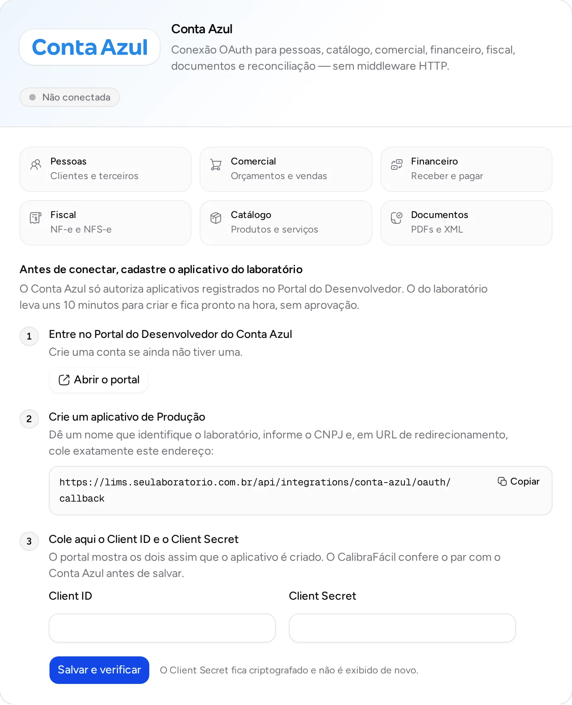
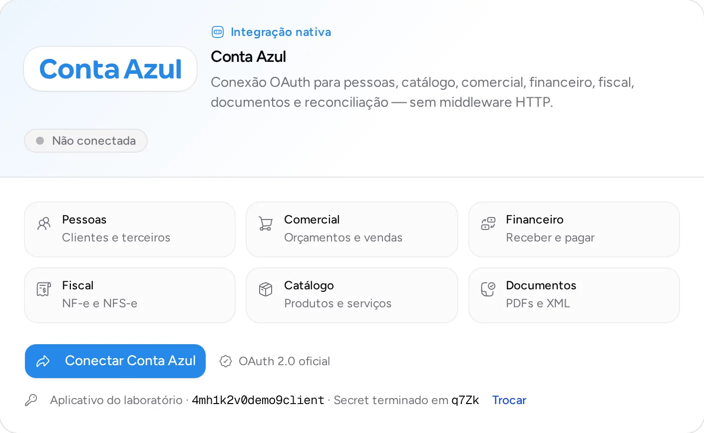

A integração nativa com o [Conta Azul](https://contaazul.com) sincroniza pessoas, catálogo, orçamentos e vendas, contas a receber e a pagar, notas fiscais e documentos, e reconcilia o que mudou dos dois lados. A conexão é feita por OAuth: alguém do laboratório entra na própria conta do Conta Azul e autoriza o acesso, sem senha guardada no CalibraFácil.

Acesse em **Configurações → Integrações** (`/dashboard/settings/integrations`). A tela é restrita a administradores do laboratório.

## Antes de conectar: o aplicativo do laboratório

O Conta Azul só autoriza aplicativos registrados no Portal do Desenvolvedor dele. Como cada instalação do CalibraFácil roda no próprio servidor, cada laboratório registra o seu, uma única vez, em cerca de 10 minutos. O aplicativo fica pronto na hora: o Conta Azul não exige envio nem aprovação para produção.

Enquanto não houver um aplicativo, a tela de integrações mostra o passo a passo no lugar do botão **Conectar Conta Azul**:

1. **Entre no [Portal do Desenvolvedor do Conta Azul](https://developers-portal.contaazul.com/)** e crie uma conta, se ainda não tiver.
2. **Crie um aplicativo de Produção.** Dê um nome que identifique o laboratório, informe o CNPJ e, em **URL de redirecionamento**, cole o endereço mostrado na tela (botão **Copiar**). É o endereço da API do seu servidor seguido de `/api/integrations/conta-azul/oauth/callback`, e precisa ser idêntico, caractere por caractere.
3. **Cole o Client ID e o Client Secret** que o portal mostra ao criar o aplicativo e clique em **Salvar e verificar**.

Ao salvar, o CalibraFácil confere o par com o Conta Azul antes de gravar: um Client ID ou Client Secret errado é recusado na hora, com a mensagem _O Conta Azul recusou este Client ID e Client Secret_. O Client Secret fica criptografado no banco e não volta a ser exibido; a tela mostra só os quatro últimos caracteres, para identificar qual está gravado.

## Conectar a conta

Com o aplicativo cadastrado, clique em **Conectar Conta Azul**. O Conta Azul abre a tela de login dele; depois de entrar e autorizar, você volta para as integrações com a conta conectada.

Se a URL de redirecionamento cadastrada no aplicativo for diferente da mostrada pelo CalibraFácil, o próprio Conta Azul mostra um erro e não volta para o CalibraFácil. Confira cada caractere, inclusive `https` e as barras. Quando a conexão falha depois do login, a tela de integrações explica o motivo.

## Trocar ou remover o aplicativo

Em **Trocar** (antes de conectar) ou no menu de ações da integração, em **Aplicativo Conta Azul** (com a conta conectada), dá para:

- **Gravar um novo Client Secret do mesmo aplicativo**, por exemplo depois de gerar outro no portal. A conexão continua.
- **Usar outro aplicativo** (outro Client ID). A conexão atual passa a pedir reconexão, porque os tokens pertencem ao aplicativo que os emitiu.
- **Remover o aplicativo.** A conta conectada deixa de sincronizar até que um aplicativo seja cadastrado de novo e a conta, reconectada.

Cada gravação e remoção fica na trilha de auditoria do laboratório, sem o Client Secret.

## Servidores que fornecem o aplicativo

Quem opera um servidor com vários laboratórios pode registrar um único aplicativo e fornecê-lo a todos, definindo no ambiente da API:

| Variável | Valor |
| :--- | :--- |
| `CONTA_AZUL_CLIENT_ID` | Client ID do aplicativo do servidor |
| `CONTA_AZUL_CLIENT_SECRET` | Client Secret do aplicativo do servidor |
| `CONTA_AZUL_OAUTH_REDIRECT_URI` | Opcional: substitui a URL de redirecionamento padrão, `API_URL` seguido de `/api/integrations/conta-azul/oauth/callback` |

Nesse caso os laboratórios conectam direto, sem cadastrar nada. Um laboratório que cadastre o próprio aplicativo passa a usar o dele.
