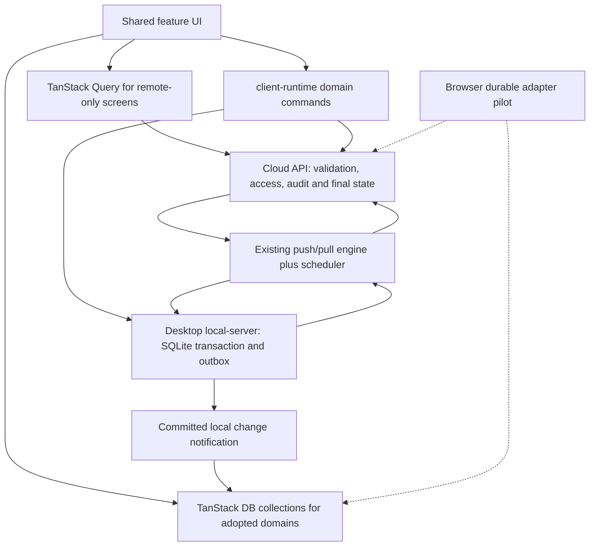

# Local-first tooling decision and research

Researched: 2026-09-09. Status: recommended architecture and bounded pilot, not an adopted dependency migration. Companion to [the parity plan](./plan.md). Desktop is pre-launch; current source demonstrates partial local-first support, not measured poor performance.

## Recommendation

**Keep the current SQLite/outbox + TanStack Query architecture as the default, and complete its local-first lifecycle. Do not expand TanStack DB adoption yet.** First prove one calibration journey with automatic sync, committed-change notifications, targeted Query cache refresh/update, restart recovery and canonical reconciliation.

TanStack DB is a candidate for shared entity projections, local joins and coordinated optimistic views if the baseline exposes a specific need. Its presence in one jobs-list hook does not establish that need. Benchmark that wrapper against plain Query; remove it only if the comparison confirms it adds no useful behavior. This is a narrower, better-supported recommendation than making a new reactive layer the starting assumption.

For browser durability, compare a narrow IndexedDB adapter (for example Dexie) with TanStack SQLite persistence/execution only once the required offline workflows are defined. If TanStack DB earns adoption for the UI, its persistence adapter becomes more attractive. **PowerSync is the strongest replacement candidate among the researched options if owning our sync machinery proves too costly**, subject to a like-for-like integrity and operations comparison. Being pre-launch makes replacement feasible; existing code is useful evidence, not a reason to keep a failing architecture.

These are separable decisions: reactive queries, durable storage, write delivery, and server-to-client synchronization. Installing TanStack DB alone does not connect all four. Current TanStack packages do offer persistence and offline execution; it would be inaccurate to dismiss the ecosystem as exclusively in-memory. [TanStack overview](https://tanstack.com/db/latest/docs/overview), [persistence release](https://tanstack.com/blog/tanstack-db-0.6-app-ready-with-persistence-and-includes).

Do not add all the tools below. The comparison supports choosing one owner for each responsibility.

## 1. Repository evidence and version baseline

| Component                                                 | Observed state                                                                                                  | Meaning                                                                                                                                     |
| --------------------------------------------------------- | --------------------------------------------------------------------------------------------------------------- | ------------------------------------------------------------------------------------------------------------------------------------------- |
| `@tanstack/react-db`                                      | Installed 0.1.85; package depends on `@tanstack/db` 0.6.7                                                       | Already available, but current online documentation may describe a newer API                                                                |
| `@tanstack/query-db-collection`                           | Installed 1.0.38                                                                                                | Existing REST/hybrid-client collection integration                                                                                          |
| `features/jobs/use-jobs-list-data.ts`                     | Builds a collection per organization/page/search/status, keyed by job ID; also uses Query for response metadata | A reactive page projection, not a persistent shared jobs database                                                                           |
| `features/jobs/queries.ts`                                | List is paginated; detail is separate                                                                           | Cannot treat a page response as the entire jobs entity collection                                                                           |
| `packages/local-db` and `apps/local-server`               | Domain SQLite storage, queued commands, conflict handling, schema migrations                                    | Preserve or deliberately replace these responsibilities; do not duplicate them                                                              |
| `apps/local-server/src/sync.ts`                           | Serialized sync runs, cursor-based pull with a 20-page convergence guard                                        | Delta pulling already exists; audit scheduling, large backlogs, checkpoint atomicity and notifications rather than invent a second protocol |
| `packages/client-runtime/src/transport/desktop-client.ts` | Local-first reads plus read-triggered background sync                                                           | Good starting seam for reactive data propagation                                                                                            |

The jobs hook's collection and Query observer share a query key/client; that alone does not prove duplicate HTTP calls. Measure observer lifetime, collection cleanup and actual requests. The key includes organization but not explicit unit; verify scope invalidation across the entire runtime before calling this a confirmed data leak.

Registry snapshot obtained read-only from the npm registry on the research date:

| Package                                    | npm `latest` snapshot | Adoption status                                                |
| ------------------------------------------ | --------------------- | -------------------------------------------------------------- |
| `@tanstack/db`                             | 0.8.7                 | Compare migration from installed 0.6.7 during pilot            |
| `@tanstack/react-db`                       | 0.3.7                 | Upgrade only as a compatible tested set                        |
| `@tanstack/browser-db-sqlite-persistence`  | 0.2.20                | Browser pilot candidate                                        |
| `@tanstack/electron-db-sqlite-persistence` | 0.1.32                | Evaluated; not needed for the initial existing-SQLite approach |
| `@tanstack/offline-transactions`           | 1.0.53                | Browser pilot candidate; not a desktop queue add-on            |

All five registry manifests reported MIT. This does not establish the license or compatibility of every transitive dependency. These independently versioned packages do not need matching version numbers. Registry metadata and upstream `main` READMEs are a research snapshot; before implementation inspect the selected release tarballs, dependency ranges, migration guides and exact APIs. No packages or lockfile were changed by this research.

## 2. Options and fit

| Option                                      | Provides                                                                | What we still own / change                                                                                                | Decision                                                                     |
| ------------------------------------------- | ----------------------------------------------------------------------- | ------------------------------------------------------------------------------------------------------------------------- | ---------------------------------------------------------------------------- |
| Query + current SQLite/outbox               | Cached requests and existing durable domain commands                    | Shared entity consistency, reactive local notifications, scheduling, browser persistence                                  | **Recommended default**; complete and measure first                          |
| TanStack DB + current SQLite/outbox         | Live collection queries, shared reactive views, optimistic presentation | Local-to-collection bridge, canonical reconciliation, domain queue, browser adapter                                       | Conditional experiment; only for demonstrated reactive-view needs            |
| TanStack persistence + offline transactions | Durable collections and an offline mutation executor                    | Server API, conflict/domain decisions, cross-store recovery, auth, file lifecycle                                         | **Browser pilot**, not automatic desktop replacement                         |
| PowerSync + optional TanStack DB            | Managed synchronization architecture and local SQLite SDKs              | Sync service, replication setup, authorized data selection, backend upload connector, migration from current queue/schema | **Strongest replacement candidate**                                          |
| Electric + TanStack DB                      | Postgres-to-client read synchronization                                 | Existing write API/outbox, persistence, authorized shapes, replication operations                                         | Consider if read freshness/fan-out is the primary bottleneck                 |
| Zero                                        | Reactive query synchronization and optimistic client/server mutators    | `zero-cache`, replication, query/mutator endpoints, ported domain behavior                                                | Larger architecture change; not first choice for this existing command model |
| RxDB                                        | Reactive local database and custom backend replication                  | Storage choice, document modeling, adapter/conflict mapping, licensing review                                             | Viable fallback, more storage/model migration than first choice              |
| Dexie                                       | IndexedDB transactions and reactive browser queries                     | Our full sync protocol, command queue and cross-host adapter                                                              | Browser storage fallback if SQLite WASM is unsuitable                        |

The decisions in the final column are project-specific engineering judgments, not benchmark results.

### TanStack DB and Query Collections

TanStack DB offers collections, live queries and optimistic mutations. Query Collections connect those to existing APIs; their default full-state result replaces the collection's contents. On-demand mode instead supplies subset predicates to the loader. Stable row keys and correct dataset boundaries are prerequisites. [Overview](https://tanstack.com/db/latest/docs/overview), [Query Collection semantics](https://tanstack.com/db/latest/docs/collections/query-collection).

Application consequence: do not turn our current paginated jobs endpoint into an eager organization-wide collection. Choose either explicit page collections or a tested subset adapter. Track which data is loaded; local search cannot claim exhaustive results outside that scope. Keep API totals separate from loaded-row counts. A detail DTO and a list DTO should not overwrite each other indiscriminately.

Use domain actions for execution/approval instead of generic row updates that bypass validation. Optimistic presentation is not durable-save acknowledgement. TanStack's mutation lifecycle distinguishes optimistic state from confirmed state; our adapter must connect that lifecycle to local persistence and eventual cloud acceptance. [Mutation guide](https://tanstack.com/db/latest/docs/guides/mutations).

### TanStack persistence and offline execution

The 0.6 announcement introduced SQLite persistence across runtimes and called that initial persistence release alpha. It also describes differing schema-version behavior: a synced cache may be cleared and reloaded, whereas local-only data needs explicit migration. That historical alpha label is not proof that every current package is still alpha; test the selected versions and treat queued work separately from disposable cache. [Release announcement](https://tanstack.com/blog/tanstack-db-0.6-app-ready-with-persistence-and-includes).

The browser adapter uses wa-sqlite/OPFS in a worker. Its README makes shared-database multi-tab coordination opt-in through a coordinator using Web Locks and BroadcastChannel. Capability failures are explicit. This is promising for browser/desktop behavior alignment, but browser storage does not acquire desktop filesystem guarantees. [Browser adapter](https://github.com/TanStack/db/tree/main/packages/browser-db-sqlite-persistence).

The offline executor supplies persisted mutations, retry and leadership behavior. Its current README describes non-leader tabs as online-only, whereas the persistence coordinator forwards follower writes to its leader. Do not assume those two mechanisms automatically compose into unrestricted offline editing in every tab. Confirm actual release behavior with two tabs, leader termination and restart. Also test queue persistence succeeding before collection persistence and vice versa. [Offline executor](https://github.com/TanStack/db/tree/main/packages/offline-transactions).

The Electron adapter provides a main/renderer persistence bridge. Our durable database currently belongs to local-server; adopting that adapter as-is would change ownership. Its example is not a reason to expose unrestricted `ipcRenderer` or SQL through our sandboxed renderer. Initially hydrate TanStack collections from the existing local-server instead. [Electron adapter](https://github.com/TanStack/db/tree/main/packages/electron-db-sqlite-persistence).

### PowerSync

PowerSync combines a sync service, local SQLite client SDKs and backend integration. Local writes enter an upload queue; our connector sends them to our backend. TanStack DB has a PowerSync collection adapter, so choosing PowerSync need not mean abandoning the proposed reactive UI layer. [Architecture](https://docs.powersync.com/architecture/architecture-overview), [writes](https://docs.powersync.com/client-sdks/writing-data), [TanStack integration](https://tanstack.com/db/latest/docs/collections/powersync-collection).

This is the best alternative if we want to own less replication machinery. It is not a plug-in for arbitrary existing SQLite tables/outbox semantics. Evaluate SDK-owned storage, backend rejection handling, partial replication and domain-command encoding. The Node and browser SDK paths need separate Electron/OPFS validation. [Client architecture](https://docs.powersync.com/architecture/client-architecture), [Node SDK](https://docs.powersync.com/client-sdks/reference/node), [web SDK](https://docs.powersync.com/client-sdks/reference/javascript-web).

Project gate: can we preserve command-level calibration validation, one audit trail, attachments, local IDs and server-authoritative approval without duplicating the existing queue? Being pre-launch lowers migration cost, so compare future ownership cost rather than rejecting this option merely because code already exists.

### Electric

Electric synchronizes the read path from Postgres; it deliberately does not prescribe write-path synchronization. That fits retaining our Hono commands, but it would not by itself replace the desktop outbox or solve durable browser writes. [Write architecture](https://electric-sql.com/docs/guides/writes).

Its auth guide supports authorizing shapes through a proxy/gatekeeper. We would define shape scope on the server from authenticated organization/unit/access, not trust client-provided filters. [Auth guide](https://electric-sql.com/docs/guides/auth).

Project gate: prove authorized read projections cover our DTO needs and all mutation sources, while domain commands and their acknowledgements remain coherent. Consider it before building a large custom real-time fan-out service if measurements identify that need.

### Zero

Zero mutators run optimistically on the client and execute server-side through a push endpoint; database changes replicate through `zero-cache`. Permissions can be implemented in server query/mutator context. [Mutators](https://zero.rocicorp.dev/docs/mutators), [authentication and permissions](https://zero.rocicorp.dev/docs/auth), [Postgres setup](https://zero.rocicorp.dev/docs/connecting-to-postgres).

Project implication: attractive for a broad redesign of interactive reads/writes, but porting our regulated commands and local execution engine is a larger change. Do not reject it on an outdated assumption that custom server-side permission logic is unavailable. Require separate evidence for our long-offline/restart and native SQLite/device workflows before considering it a replacement.

### RxDB and Dexie

RxDB can replicate against custom HTTP backends with checkpoints and change streams/resync signals. It introduces its own client model and replication semantics. Its SQLite storage has premium considerations to review for the selected deployment. [Replication](https://rxdb.info/replication.html), [HTTP backend](https://rxdb.info/replication-http.html), [SQLite storage](https://rxdb.info/rx-storage-sqlite.html).

Dexie provides reactive IndexedDB queries and is a narrower browser persistence choice. It would leave our sync engine and queue implementation with us; the Dexie library should not be confused with adopting a managed synchronization service. [Dexie live queries](https://dexie.org/docs/liveQuery%28%29).

Do not combine these with TanStack persistence merely to cover the same responsibility. Pick one durable browser storage strategy after testing.

## 3. Ownership and conditional TanStack DB data flow

The default path is UI → Query → client-runtime → local SQLite/cloud, with committed changes refreshing affected Query entries. The diagram below applies only if TanStack DB passes its adoption gate; it is not required to make the current stack local-first.

Rules for implementation:

1. **One durable command owner per host and domain.** Desktop writes go through existing local-server transactions. Do not mirror the same command into TanStack's offline executor. In a browser pilot choose its executor or an application queue, never both.
2. **One reactive representation per adopted entity scope (if TanStack DB is selected).** TanStack DB collections are views over authoritative local state, not an independently mutable second database. Query may transport rows/metadata without becoming a competing mutation owner.
3. **Stable identity.** Keep local/public/server identifiers explicitly mapped. Use a stable collection key that survives acknowledgement. Prove create → edit → server-ID mapping with parent/child references; do not assume library upsert solves this.
4. **Atomic local capture.** Domain changes and desktop outbox insertion commit together. Only then display “saved on device.” Remote acceptance/conflict is a later state. Treat lost local acknowledgements idempotently too.
5. **Reactive propagation.** After local commits and sync application, notify the renderer using a typed, scoped change channel. Begin with entity IDs/revision plus targeted reloads through client-runtime. Reconnect from a revision or safely rehydrate after missed events. Do not broadcast full tenant data to every window.
6. **Scoped lifetime.** Registry lifetime follows user/organization/unit; close subscriptions and clear views on switch/logout. Scope selection is not authorization. Retain pending work according to the existing access policy without leaking it into a new session.
7. **Canonical reconciliation.** A cloud acknowledgement updates local rows, queue state, identity mapping and checkpoint consistently. Server values replace optimistic projections only when their corresponding command is accounted for. Preserve later unsent edits.
8. **Partial datasets.** Maintain loaded-subset metadata and bounded memory. Offline joins require downloaded dependencies; missing rows are not confirmed deletions. Tombstones and access revocations need explicit application.
9. **Domain authority.** Local UI can say submission is queued; it cannot claim an issued certificate, sent email, accepted payment or approved job before server confirmation.
10. **Keep module boundaries.** Domain collection definitions belong in `features/<domain>`; generic registry/lifecycle in shared/runtime modules; transport/command/change interfaces in client-runtime and contracts. No raw server imports or Electron APIs in product features.

A renderer collection snapshot is optional on desktop because SQLite already survives restart. Benchmark hydration first; avoid adding a second persisted copy just to make both hosts use the same package.

## 4. Tools we actually need

| Responsibility                       | Initial tool / action                                                         | New dependency?                                        |
| ------------------------------------ | ----------------------------------------------------------------------------- | ------------------------------------------------------ |
| Reactive adopted views               | Existing Query; conditional TanStack DB experiment for complex shared views   | No initial addition; upgrade only if pilot requires it |
| Remote queries                       | Existing TanStack Query                                                       | No                                                     |
| Desktop durable data and queued work | Existing SQLite, local-db and outbox                                          | No                                                     |
| Cloud synchronization                | Existing cursor push/pull plus lifecycle scheduler and commit notifications   | No new service for pilot                               |
| Browser durable data                 | Compare narrow IndexedDB storage with TanStack SQLite persistence             | Pilot only                                             |
| Browser durable command delivery     | Trial `@tanstack/offline-transactions`, subject to leadership/recovery gates  | Pilot only                                             |
| Correctness                          | Existing Vitest and Playwright; packaged Electron launch adapter              | Extend harness                                         |
| Responsiveness evidence              | User Timing, React profiling, Chromium/Electron traces and scripted scenarios | No new application service                             |
| Large rendered lists                 | Add virtualization only if rendering traces justify it                        | Deferred; DB live queries do not virtualize DOM        |

Do not add a CRDT engine for structured calibration approvals or financial workflows. The present requirement is ordered domain commands, conflict detection and canonical server decisions. Rich-text concurrent editing would be a separate reason to evaluate CRDTs.

No vendor subscription, deployment, database replication setting, or package installation is required for this research update.

## 5. Pilot and go/no-go criteria

### A. Version and baseline check — 1–2 engineer-days

Record exact selected package versions and compatibility, current jobs collection/query behavior and Node >=24 environment. Run current Query/local-server path as the control. Measure 100, 1,000 and 10,000 scoped jobs with representative method/readings payloads; record warm/cold startup, list → detail → execution, durable save, memory, render counts and actual network requests. Row counts are fixture sizes, not claims about expected production volume.

### B. Desktop vertical slice using current stack — 3–5 engineer-days

Use assigned jobs plus required asset/customer/method data. Add typed local change notifications and scoped Query updates/refetches. Save readings through existing domain commands; show the committed local state across list/detail/execution. Ensure local HTTP queries can run while browser network status is offline; test Query network-mode behavior for cloud versus loopback requests. Add automatic post-write/reconnect sync and canonical propagation. Restart offline and reconcile with a browser edit. Implement the minimum required sync lifecycle early rather than waiting for the broad Phase 3 rollout.

Go only if it meets the main plan's provisional responsiveness budgets, survives process termination after local acknowledgement, has no stale-state reversion, and maintains scope isolation. If Query plus targeted change invalidation meets the same requirements more simply, retain that path for the domain; TanStack DB adoption is not a success metric itself.

### C. Browser durability proof — 3–5 engineer-days, after offline scope is defined

Compare a narrow browser persistence/queue adapter with TanStack persistent collections and its offline executor, using the same domain command payloads. If this scope is not required for initial release, defer the browser spike. Test hydration, eviction/quota errors, two tabs, leadership changes, explicit restart, expired auth, version migration, schema reset with pending work, unknown mutation names after upgrade, rejected commands and attachments. Resolve the command's durable state without relying on a still-mounted React component.

Persisted Query cache alone is not the acceptance criterion: it stores query cache, and can be discarded by age/version rules. [Query persistence](https://tanstack.com/query/latest/docs/framework/react/plugins/persistQueryClient). Browser storage is generally best-effort unless persistence is granted, and storage limits/failure modes vary. Provide accurate readiness/failure UI; neither OPFS nor IndexedDB permits promising survival after the user clears site data. [Browser storage](https://developer.mozilla.org/en-US/docs/Web/API/Storage_API/Storage_quotas_and_eviction_criteria).

Fail this candidate if follower tabs can acknowledge offline work without durable recovery, migration loses pending commands, or required browser environments cannot support the selected storage mode. An explicit supported-browser limitation or reduced offline scope needs a product decision; never silently fall back to volatile storage while showing “saved.”

### D. Conditional TanStack DB experiment — 2–3 engineer-days

Run only if the baseline exposes repeated cross-view inconsistency, complex local joins/derived views, fragile optimistic bookkeeping, or a measured query-computation bottleneck. Compare the same job list/detail/execution views with a scoped collection adapter. Require either a measured responsiveness improvement or demonstrably simpler consistency logic with unchanged correctness. Count adapters and collection lifetime/reconciliation code as well as code removed. Slow rendering, slow SQLite queries, and slow cloud requests are not by themselves evidence that another client store helps. Do not run this experiment merely because TanStack DB is installed.

### E. PowerSync comparison — 2–3 engineer-days if replacement remains competitive

Use the same slice and assertions. Map one domain command through its upload connector, reconcile server changes and test denied/stale writes. Establish migration/export/import of a pending existing command and native-driver coexistence. Compare custom code removed against new service operations, data-selection rules, SDK migrations and backend adapters introduced.

Before selecting a service-backed candidate, record managed/self-hosted options, source-database logical replication compatibility, hosting/network placement, expected active clients/data volume, egress, monitoring, recovery, licensing and a current vendor quote. Exact pricing and a full deployment compatibility audit are not established by this document. Do not assume an additional sync service can run inside the existing request handler.

Choose PowerSync if it passes the same integrity tests and materially reduces ownership cost. Revisit Electric if the unsolved problem is principally read replication/freshness. Keep the existing engine if it passes and replacement adds more complexity than it removes.

### F. Decision output

Produce a short accepted ADR with exact versions, timings/traces, failure results, retained/replaced modules, owner of every queue/store, migration strategy and rollback method. Rollback of a view-layer pilot should rehydrate from existing SQLite; a queue/storage replacement must first reconcile or export every pending command. No blanket rewrite of 49 API namespaces.

Initial A–B budget: 4–7 engineer-days. Browser durability adds 3–5 days only if in scope; TanStack DB and PowerSync comparisons are conditional. These are bounded learning estimates, not implementation commitments or measured delivery times. Broader parity phases must be re-estimated after the pilot rather than simply adding all ranges together.

## 6. Research confidence and remaining questions

Confirmed: TanStack DB is already used; current upstream persistence/executor options exist; alternatives have the capabilities linked above; our app already has cursor-based sync and SQLite/outbox. Recommended: one complete measured journey with the current stack first; adopt a new reactive layer only if its benefits are demonstrated.

Not established: production performance, complete browser/Electron adapter compatibility, atomic recovery across TanStack persistence and executor stores, current vendor total cost, or complete backend replication-host compatibility. Upstream `main` documentation and npm versions may differ; pin and inspect the release selected for each spike. No performance claims from vendor demos are adopted as our measurements.
