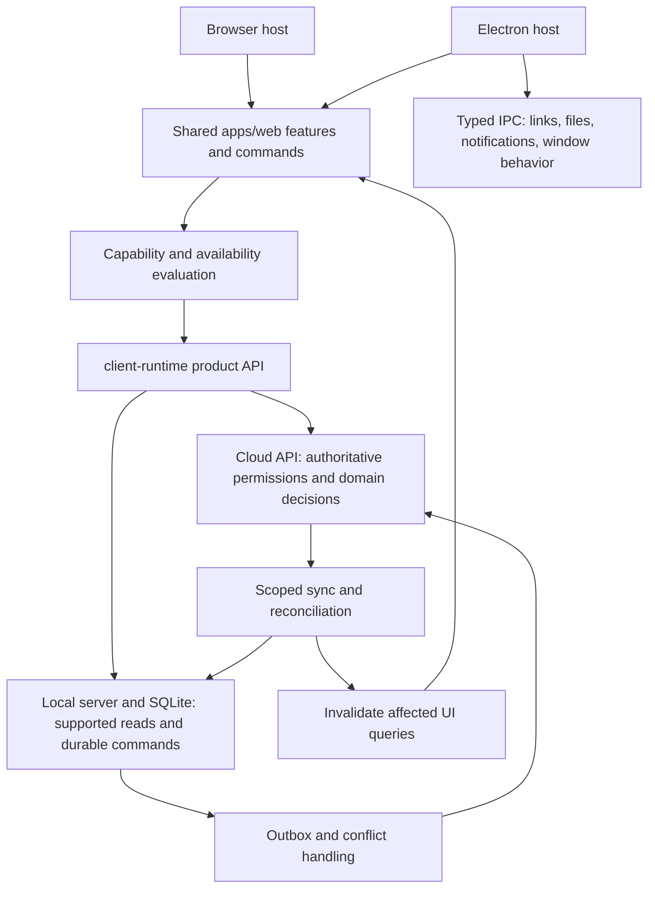

# Desktop/web parity and desktop experience plan

Date: 2026-09-09. Source baseline: `82303912`.
Status: implementation in progress. Source audit, focused tests and tooling research completed; packaged interaction audit and performance baseline pending. Desktop is pre-launch.

**Implemented so far** (branch `feat/desktop-web-parity`): PAR-02 (operation availability), PAR-04 (canonical reconciliation), PAR-05 (job online parity), PAR-06 (service-order online parity), PAR-07 (methods and the remaining connected surfaces found in the sweep), and the scheduler half of PAR-08 (continuous sync triggers, coalescing, backoff and host wake signals). See §10.

PAR-10 and PAR-11 followed on branch `feat/desktop-experience`: window persistence, back/forward, OS deep links, native notifications, the unread badge, and file naming/reveal.

**Not started**: PAR-01/01A (the executable ledger and dual-host harness — all of this was done against unit and component tests, not a packaged Electron run), PAR-03 (auth/transport/bootstrap recovery), the queue-durability and conflict-UX half of PAR-08, PAR-09 (field package and conflict UX), PAR-12 (tabs) and PAR-13 (installer/update/platform gates).

Tooling decision: [local-first tooling research](./local-first-tooling.md). Keep SQLite/outbox + TanStack Query as the default. TanStack DB is already used on one jobs list, but expanding it requires evidence from the pilot below; no new sync service or dependency is selected.

## 1. Product contract

CalibraFácil should be one product delivered through the browser and a desktop host. For the same supported release, identity, organization, unit, permissions, entitlements, and connectivity, every lab-dashboard workflow must be discoverable and produce equivalent domain outcomes in both clients. Desktop adds operating-system integration and field resilience.

Recommended release boundaries, pending product preferences:

- **Online parity is mandatory:** no lab workflow requires opening the browser just because the user launched Electron. Browser handoffs for identity providers, payment providers, and external integrations are valid when the return completes reliably in desktop.
- **Offline capabilities are explicit:** complete the supported field workflows and expose honest availability for cloud-dependent actions. Full browser/desktop offline equivalence is a separate expansion, not something this audit establishes.
- **Windows is the initial release gate:** it has the existing release pipeline. Include macOS/Linux in the design and implement their build/test distribution gates before advertising equivalent support.
- Scope is `apps/web` lab dashboard, its authentication and external handoffs, `apps/desktop`, client contracts/runtime, and required local/cloud sync behavior. `apps/portal`, `apps/backoffice`, CMS/site/docs/video are separate products; include links and handoffs to them, not their wholesale embedding into desktop.
- Match domain behavior, access, data, navigation, and interaction quality. Native window chrome and hardware capabilities may differ intentionally. Do not use a cosmetic screenshot match as the definition of parity.

Linear's useful benchmark is a shared product with desktop enhancements, local reads and incremental synchronization. Its engineering documentation describes local databases and a checkpointed change log, while its app documentation cautions about offline conflict behavior. Use that responsiveness model without copying its domain conflict rules. Sources: [Linear engineering](https://linear.app/now/rebuilding-delta-sync-read-path), [app documentation](https://linear.app/docs/get-the-app), consulted 2026-09-09.

The product needs a local-first operational experience, not a particular library. Default to the existing durable storage and command model, make committed changes visible promptly, and preserve server authority for final decisions. Full durable browser offline behavior remains a separately scoped requirement.

## 2. What the current code establishes

This is a source-backed baseline, not a claim that every screen has been exercised. No production credentials, production mutations, or packaged interactive sessions were used.

| Finding                                                                                                                | Evidence                                                                                                                                                        | Implication                                                                                                                             |
| ---------------------------------------------------------------------------------------------------------------------- | --------------------------------------------------------------------------------------------------------------------------------------------------------------- | --------------------------------------------------------------------------------------------------------------------------------------- |
| Desktop already packages the web renderer                                                                              | `scripts/build-desktop-artifact.mjs` builds `apps/web` into `apps/desktop/dist/renderer` and checks a renderer manifest                                         | Keep the shared frontend; avoid a desktop UI fork                                                                                       |
| Desktop uses a hybrid client                                                                                           | `apps/web/src/utils/api.ts`; `packages/client-runtime/src/index.ts:createDesktopHybridApiClient`                                                                | Cloud methods are already available to connected desktop                                                                                |
| Policy inventory has 374 methods across 49 namespaces                                                                  | `packages/client-runtime/src/data-policy.ts`; accompanying CSV                                                                                                  | 336 cloud-only, 21 local-first reads, 12 queued local commands, 5 local-only methods; counts describe routing, not feature completeness |
| Cloud-only route gates are connectivity-aware                                                                          | `app/router/route-meta.ts`, `runtime/cloud-only-routes.ts`, `runtime/sync-status-model.ts`                                                                      | Do not mistake the 13 route rules for 13 universally unavailable desktop sections                                                       |
| Job actions still reject desktop unconditionally                                                                       | `features/jobs/detail-page.ts`: technician query, mutation guards, canApprove/canReject/cancel conditions                                                       | Confirmed source-level online parity gap: approval, rejection, cancellation, assignment                                                 |
| Service-order actions still disable desktop unconditionally                                                            | `features/service-orders/detail-page.ts`: intake documents, tags, service start, evaluation, quote sending, repair mark, delivery, delivery PDF, communications | Confirmed source-level online parity gaps spanning a core end-to-end workflow                                                           |
| Method-template entry is hidden on desktop                                                                             | `features/methods/list-page.ts:isCloudRuntime`                                                                                                                  | Connected desktop loses a cloud-supported discovery path                                                                                |
| Local reads win after bootstrap                                                                                        | `transport/desktop-client.ts:withDesktopLocalFirstReadThroughSync`                                                                                              | Cloud mutations may be followed by stale local reads; removing UI guards alone is insufficient                                          |
| Read-triggered background sync already exists                                                                          | `transport/desktop-client.ts:createDesktopBackgroundSyncRequester`: coalesced, 60-second throttle                                                               | Improve existing sync; do not describe it as entirely manual                                                                            |
| A continuous sync lifecycle is not established by the inspected runtime                                                | `apps/local-server/src/server.ts`: explicit start/retry; pause responds “Continuous sync is not running.”                                                       | Need a durable scheduler, reconnect/resume triggers, and post-write scheduling independent of screen reads                              |
| Electron does not register the web service worker                                                                      | `runtime/register-pwa.ts`                                                                                                                                       | Browser caching and desktop SQLite are different mechanisms; PWA registration does not establish offline domain parity                  |
| Navigation prewarming skips desktop                                                                                    | `lib/route-prewarm.ts`, `lib/use-route-prewarm-intent.ts`                                                                                                       | Benchmark before deciding which preload/prefetch behavior to share                                                                      |
| Command palette and search already exist                                                                               | `components/command-palette/*`, `features/command-palette/global-search.ts`                                                                                     | Extend shared commands and history rather than build another palette                                                                    |
| Shell has isolation, IPC contracts, recovery, support export and guarded updates                                       | `apps/desktop/src/main/*`, `src/preload/*`, `packages/contracts/src/desktop.ts`                                                                                 | Preserve these foundations; shell polish is incremental                                                                                 |
| Native tabs, notification delivery, badge handling and OS deep-link activation were not found in inspected host/bridge | `main.ts`, `main-window.ts`, `contracts/src/desktop.ts`                                                                                                         | Proposed desktop enhancements; verify all entry points in the packaged audit before implementation                                      |
| Packaging declares all three platforms; automated desktop release is Windows-focused                                   | `electron-builder.yml`, `.github/workflows/desktop-windows-release.yml`, `desktop-publish-update-feed.yml`                                                      | Build targets are not evidence of equivalent installation/update support                                                                |
| Existing parity tests test transport composition, not full user journeys                                               | `desktop-policy-parity.test.ts`; `scripts/smoke-desktop-cloud-parity.mjs`                                                                                       | Add real renderer/host and persisted-outcome checks                                                                                     |

The July audit (`docs/auditoria/2026-07/10-fatia-desktop-offline-sync.md`) is historical context only. Instrument capture and offline NC creation now have implementations; its corresponding absence claims are stale. Migration counts are not a measure of feature parity, and retained historical SQLite columns are not independently parity defects.

## 3. Required workflow coverage

Every row requires browser-online and desktop-online execution against identical seeded scenarios. Offline entries are proposed targets; current policy is in the CSV. A method's presence is not evidence its UI, serialization, local ID mapping, or permissions work.

| Domain                      | Online parity checks                                                                                                        | Offline target / constraint                                                                                                   |
| --------------------------- | --------------------------------------------------------------------------------------------------------------------------- | ----------------------------------------------------------------------------------------------------------------------------- |
| Identity and startup        | Email login, available magic-link/OTP/SSO/passkey/MFA paths, invitation, redirect, expiry, reauth, sign-out, session revoke | Prior authorized session only; first login needs cloud; explicit offline authorization lifetime                               |
| Organization/unit/access    | Switch organization/unit, role changes, finance module, plan limits, all-unit views                                         | Partition cached data; expose last verified access; never silently cross scopes                                               |
| Dashboard and search        | Counts, filters, pagination, sort, global search, navigation, empty/loading/error states                                    | Mark cache age/completeness; search only downloaded scope                                                                     |
| Customers/groups            | Create/edit/detail, compliance, audit, members/invitations, branch management, CNPJ lookup                                  | Existing customer commands survive restart; group administration and lookup may require cloud                                 |
| Assets/types                | All fields, legal-metrology fields, dates, customer links, audit, filtering                                                 | Equivalent local payload semantics, related local IDs and schema round trips                                                  |
| Services/materials          | Catalog management, prices, stock and material picker                                                                       | Cache needed catalog references; queue intended material identity; never imply stock was decremented before server acceptance |
| Methods                     | Templates, creation/versioning, compiler preview, review/approval/publication, audit                                        | Pin published execution definition and engine compatibility; authoring/publication remain online initially                    |
| Standards/environment/scope | Standards, renewal/documents/recall, compositions, environmental limits, accredited scope                                   | Download complete dependencies for assigned work; warn about expired or incomplete reference data                             |
| Calibration jobs            | Create, assign, execute, save, submit, review, reject, approve, cancel, amend, out-of-tolerance, certificates and labels    | Durable measurement capture and draft submission; server acceptance controls final approval/publication                       |
| Service orders              | Intake, evaluation, quote, materials, send, execution, repair marks, delivery, PDFs, communications                         | Current queued writes plus explicit dependency sequencing; cloud delivery/sending only after required local changes sync      |
| Quality                     | NC, CAPA, impact assessment/sign-off, proficiency plans/results, SPC, competence/training                                   | Preserve NC capture; add domain reads/writes only with designed conflict semantics                                            |
| Requests and visits         | Review/convert requests, assignment, scheduling, completion and job links                                                   | Prioritize visit-day package and cached assignment context for field users                                                    |
| Finance/billing/reports     | Receivables, contracts, receipts, release policies, forecasts, exports, subscriptions, reports                              | Cloud-authoritative transactions; optional cached reports must show scope/time and incompleteness                             |
| Settings/integrations       | Members, units, numbering, signatures, signing certs, SSO, API keys, portal/email domains, notifications, integrations      | Online administration; local device settings remain accessible offline                                                        |
| Documents/files             | Uploads, attachment lists, preview, download, PDF save, print, Unicode filenames, cancellation and failures                 | Local attachments survive restart; draft explicitly distinguishable from issued certificate                                   |
| Notifications               | Same unread state, preferences, read actions and destination                                                                | Cached view optional; native delivery reconciles with server state                                                            |
| Help and navigation         | Internal links, command actions, filters, back/forward, external links, recovery/support                                    | Cached shell and supported routes load without network                                                                        |
| Hardware                    | Web-supported printing paths and desktop native printing/capture                                                            | Test supported printers/instruments, disconnect/reconnect and driver failures; no simulated equivalence claim                 |

For integrations, preserve existing provider behavior and use `docs/plans/conta-azul-product-strategy.md` before implementation touching Conta Azul. OAuth launch, cancellation, expired state, and return routing are part of desktop parity.

## 4. Target architecture

Keep contracts server-free and raw Hono calls in client-runtime. Route files remain thin; feature modules receive explicit route inputs. Shared UI owns product behavior; the host owns OS behavior; local-server owns device I/O and durable local execution.

Separate three decisions that are currently easy to conflate:

1. **Capability:** does this host implement the required mechanism, such as native printing?
2. **Availability:** are cloud, local process, scoped cache and required entity synchronization ready?
3. **Authorization:** may this identity perform this action in this organization/unit and plan? The server remains authoritative.

Derive operation availability from the existing data-policy registry plus runtime health and entity state. Avoid a second hand-maintained transport registry. Return useful reasons (needs connection, initial download, pending entity sync, expired authorization, unavailable device) instead of a single `isDesktop` boolean. Retain runtime detection for genuine host capabilities.

Do not use `navigator.onLine` or one sync failure as proof that every cloud action is unavailable. Track cloud reachability, authentication, local-process health, bootstrap completeness, pending changes and conflicts independently; classify transport failures separately from 401/403/validation responses.

For cloud writes on entities whose detail reads are local-first: validate remote identity and dependencies, settle or surface conflicting pending local edits, perform the cloud command once, reconcile canonical state into local storage, then invalidate affected queries. Until reconciliation finishes, show pending/stale status or a deliberate canonical read path. Never silently change an existing queued write into an immediate cloud write and risk duplicate effects.

## 5. Delivery sequence

Estimates below are planning ranges in engineer-weeks, not commitments; recalibrate after Phase 0. Each phase should be split into reviewable domain slices and carry its own evidence. No implementation is authorized by the existence of this planning document alone.

### Phase 0 — Executable baseline (1–2)

- Expand the supplied inventory into route/action/scenario records: stable ID, route, feature file, API methods, web behavior, desktop-connected behavior, cached-offline behavior, uncached behavior, authorization, evidence, owner, priority and expected result.
- Inventory all 145 current `.tsx` route modules; classify root/layout/public/redirect routes so they are not mistaken for 145 independent features. Enumerate actions outside routes, including dialogs, command palette, context menus and file operations.
- Audit `isDesktopRuntime`, `runtime.isDesktop`, cloud-only gates, direct fetch, `window.open`, download anchors, storage, auth and prewarm branches. Classify each as a parity defect, valid capability difference, or unresolved assumption.
- Build a reusable isolated fixture with two tenants, two units, contrasting roles/plans, representative methods, jobs, service orders, files and conflicts. No production seed writes.
- Run the same scenario harness against browser and an actual packaged Electron renderer; record package version/renderer commit/API version. Baseline screenshots and timings at matching viewport, theme and fixture.
- Output a complete coverage ledger: untested must remain untested, never counted as passing.

Exit: every in-scope route/action has a classification and scenario; every priority workflow has a recorded reproduction or passing trace. Baseline p50/p95 performance and supported OS matrix are documented.

### Phase 0A — Prove the local-first journey before selecting new tools

Use the current SQLite/outbox and TanStack Query stack for assigned job → local execution save → offline restart → automatic reconnect → canonical state visible on web. Add the minimum committed-change notifications, scoped query refresh and sync scheduling needed for that journey now; Phase 3 expands and hardens it across domains.

Measure cached navigation, durable save, startup, renderer work, memory and freshness. Confirm local loopback queries execute despite offline browser network status. Compare the existing jobs-list TanStack DB wrapper with plain Query; its presence is not proof of a benefit or a defect.

Exit: the slice meets the proposed performance/integrity budgets, or identifies the specific bottleneck and required architectural change. TanStack DB is evaluated only for demonstrated reactive-query/consistency needs. PowerSync is evaluated if custom synchronization ownership is the problem. Browser persistence is evaluated against explicit offline scope. Exact experiments, tools, sources and go/no-go criteria are in [the tooling research](./local-first-tooling.md).

### Phase 1 — Availability, auth and reconciliation foundations (1–2)

- Implement the shared availability evaluation and clear failure reasons. Preserve permission, entitlement and unit checks.
- Make local process recovery refresh endpoint/token discovery; verify the currently cached bootstrap/token behavior across process restarts and occupied-port fallback.
- Verify desktop cloud transport for JSON, multipart, binary responses, redirects, aborts, timeouts, cookies and supported auth providers. Current IPC request-body base64 buffering warrants size/memory tests.
- Define canonical refresh after cloud mutation; reconcile local/public/remote IDs and clear relevant query caches on scope changes.
- Cover fresh install, first bootstrap failure, warm cache, session expiry, logout/relogin and revoked access. Keep cached drafts safe without exposing another account's data.

Exit: state-transition tests and packaged auth/bootstrap scenarios pass; connected cloud actions are not gated by unrelated sync errors; cross-tenant/unit negative tests pass.

### Phase 2 — Restore online workflow parity (2–4)

Implement in this order, each as its own slice:

1. Jobs: technician lookup, assign, approve/reject/cancel and all related visibility/mutation guards. Use canonical state after server-side recalculation and validation.
2. Service orders: communications, intake/tag generation and opening, evaluation, quote sending, service start, repair marking, delivery and document opening. Handle unsynced entities explicitly.
3. Methods: restore template entry when available; verify versioning, compilation and approval journeys in desktop.
4. Remaining matrix: quality, visits/requests, finance, settings, reports, onboarding, integrations and file/notification flows. Test actual UI and outcome; cloud routing alone is insufficient.
5. Resolve display parity: sorting, query parameters, pagination totals, timezone/date formatting, decimal/null semantics, available actions and empty/error copy.

Exit: all in-scope connected scenarios pass in both clients for equivalent access. No runtime-only denial remains for a cloud-supported product action. Approved host exceptions are documented individually. Full job and service-order journeys complete without a workaround in the browser.

### Phase 3 — Continuous sync and field continuity (2–4)

- Add/coalesce scheduler triggers for startup, successful login, committed local mutation, reconnect, focus/resume and bounded background polling. Backoff with jitter; no busy loop or overlapping runs.
- Persist queue state transactionally with the domain change; recover after process termination. Test duplicate delivery and ambiguous acknowledgements.
- Push dependency-ordered commands, apply authoritative acknowledgements, pull scoped updates/tombstones and notify active views. Keep local dirty data until acknowledged or explicitly resolved.
- Make sync status actionable: last successful sync, pending count, retry, specific conflict destination and understandable field differences. Cover every produced aggregate type, not only four editable entities.
- Introduce field download readiness: today's visits/assigned jobs plus customers/assets, pinned methods, standards, environmental rules and necessary documents. Report missing dependencies before departure.
- Expand cached materials/visit context based on field priority. Define stock and scheduling conflict semantics before queuing those mutations.
- Define cached-authorization lifetime and revocation-on-reconnect behavior. Test device clock changes; never claim instant offline revocation.
- Handle disk full, oversized attachments, interrupted downloads, migration failures and corrupt cache with recovery that preserves pending work.

Exit: create/edit/execute offline, kill and restart, reconnect, then verify one canonical server result and matching local state. Concurrent web edits yield the agreed conflict behavior. Reconnect drains eligible work without visiting a list screen or pressing sync.

### Phase 4 — Desktop experience (2–3)

- Preserve/restore window size, position, maximized state and valid monitor placement. Respect Windows/macOS/Linux conventions and DPI scaling.
- Add back/forward controls and shared command registry/shortcut help; retain text editing and platform accelerators. Reuse the existing palette and search.
- Implement OS deep links and browser-to-desktop preference with cold/warm launch, single-instance routing, auth continuation, unknown routes and denied-access handling. The renderer's custom asset scheme is not an OS deep-link implementation.
- Integrate native notifications and unread badge state with existing notifications/preferences. Avoid duplicate deliveries; clicking opens the correct tenant, unit and entity after authorization.
- Make save/open/print behavior consistent: meaningful filenames, cancelled dialogs, expired URLs, failure recovery and revealing downloaded files.
- Add recents/favorites if absent after baseline audit; synchronize product preferences where appropriate.
- Add in-app tabs after single-window navigation and draft persistence are sound: separate route/filter/scroll history, close/reopen, unsaved-work handling and shared query cache. Bound memory and background subscriptions. Tabs must not introduce independent competing sync loops.
- Review focus, keyboard access, screen-reader announcements, contrast, reduced motion, theme, density and 100–200% scaling across hosts. Keep animations brief and interruptible; prioritize visible responsiveness.

Exit: keyboard-only critical workflows, notification/deep-link navigation, window restore and file operations pass on release platforms; recordings demonstrate the expected interaction quality.

### Phase 5 — Distribution and release enforcement (1–2, plus platform lead time)

- Preserve existing updater blocks for unsynced work, conflicts and active regulated execution. Provide a direct route to resolve the reason and retry.
- Stamp renderer commit, app version and compatible API/local-schema range. Define minimum supported desktop version and server compatibility/deprecation behavior.
- Validate fresh install, upgrade from supported prior versions, retained drafts, rollback/recovery constraints, uninstall data policy and failed/cancelled updates. Do not downgrade a local schema blindly.
- Wire macOS/Linux CI, signing/notarization where applicable, artifacts and feeds if included in release scope; test native module loading and actual device operations on each target.
- Require packaged workflow suite, migration/sync recovery, installer/update smoke, accessibility evidence and performance budgets before publication. Use an internal cohort/canary and explicit rollback criteria.

Exit: no open critical/high parity or data-loss defects; all applicable release scenarios green with reproducible artifacts; owner sign-off for any intentional exception.

### Optional expansion — Equal offline domain support in the browser

Choose browser persistence after the tooling spike: compare a narrow IndexedDB adapter with TanStack SQLite persistence/offline execution, and PowerSync if replacing synchronization. Do not add a second desktop outbox to make hosts use the same package.

If full offline parity is required, this is a separate architectural milestone. Inventory browser persistence/eviction, service-worker lifecycle, multi-tab coordination, upload storage and available device APIs. Introduce a browser persistence/queue adapter under the same product contracts, reuse domain validation and conflict rules, and exercise the same offline scenario suite on both hosts. Do not put Node/SQLite/native device dependencies into browser bundles. Estimate only after a storage/durability spike and explicit offline domain scope; not included in the ranges above.

## 6. Verification and non-regression contract

Use shared scenario definitions with browser and Electron launch adapters, not duplicated suites with different assertions. Electron tests must run the bundled renderer, preload, IPC and local server; a browser with a mocked bridge is useful unit coverage but is not the release gate.

Required dimensions:

- Connected, disconnected, degraded cloud, DNS/TLS/network failure, cloud 401/403/409/422/5xx, and connection restored mid-request.
- Fresh install/unbootstrapped, warm/current, stale/incomplete cache, pending queue, conflict, local-process restart and application restart.
- Owner/admin/technician/read-only where supported; allowed/denied plan/module; two organizations and units; role revoked between local capture and sync.
- Server entity, local unsynced entity, acknowledged entity with mapped remote ID; dependent asset/customer/job/order records.
- Empty and high-volume lists; decimal precision, null/optional fields, dates/timezones, Unicode names, file limits and interrupted transfer.
- Release OS versions/architectures and representative low-end lab hardware; real printer/instrument validation for advertised integrations.

Canonical end-to-end scenarios:

1. Sign in → select unit → find customer/asset → create job → assign → execute → submit → review/approve → download/print certificate.
2. Create service order → evaluation → material quote → send → execute → repair mark → deliver → inspect documents and communications.
3. Warm field package → disconnect → edit customer/asset → capture instrument readings → save/submit execution and NC → attach file → restart → reconnect → inspect canonical state and audit history.
4. Edit the same record on web while desktop is offline → reconnect → resolve each supported conflict outcome without losing unrelated successful events.
5. Switch identity/tenant/unit with cache and pending work → verify no stale data flashes or cross-scope reads/writes.
6. Follow notification, OAuth return and external entity link into cold and running desktop → correct authorized destination.
7. Upgrade with clean state; attempt with pending work/conflicts; resolve → retry → verify retained data and migration compatibility.

Use pairwise combinations for the broad matrix, but run all critical integrity/auth transitions explicitly. Assert durable data and side effects, not just successful toasts or HTTP 200. Verify mail/financial side effects using isolated test infrastructure.

Provisional performance acceptance targets (validate on a named reference machine and representative fixture): warm navigation p95 ≤200 ms; command-menu opening p95 ≤100 ms; durable local save feedback p95 ≤150 ms; cold interactive start p95 ≤3 s; eligible sync scheduled within 5 s of confirmed reconnect. Set queue-drain targets by payload volume/network profile. Require no >10% regression from baseline in startup/memory/critical workflows unless reviewed with evidence. These are proposed budgets, not measurements.

CI should reject newly introduced runtime-only product guards unless documented as a native capability exception. Add a completeness check tying new product methods/routes/actions to availability policy and scenario coverage. Publish tested/passing/blocked/untested counts separately. Online parity release requires 100% of the agreed connected workflow inventory passing; do not dilute that metric with intentional offline exclusions.

## 7. Dependencies, risks and sequencing decisions

- Phase 1 precedes removing sensitive job/order restrictions: stale local state and unsynced entity IDs are the main integration risks.
- Phase 0 adds the test harness early; Phase 0A proves local-first behavior with existing tools before wider architecture changes. Test infrastructure is not a final clean-up phase.
- A committed local-change signal, automatic scheduling, and canonical reconciliation are required capabilities. TanStack DB, PowerSync, Electric and other researched libraries are alternative means, not acceptance criteria.
- Phase 3's durable save/recovery behavior precedes tabs and aggressive background updates.
- Native links/notifications may proceed after auth/scope foundations, but release waits for packaged tests.
- Online parity does not require mirroring all 336 cloud-only methods in SQLite. Keep cloud authority for billing, administration and final regulated decisions unless a later scope explicitly changes it.
- Web evolves faster than installed desktop. Commit stamps alone do not solve skew; compatibility policy and routine release cadence are mandatory.
- Avoid exposing internal sync/transport terms in ordinary user flows. Provide detailed diagnostics in support surfaces with redaction; retain opt-in Sentry PII/replay settings.
- Scope expansion to full browser offline behavior or all OS releases changes cost materially. No calendar promise should be made before Phase 0.

Suggested ownership: product owns the workflow ledger/exceptions; frontend owns shared behavior and availability UX; desktop owns shell/IPC/distribution; local/server owners own sync and canonical domain outcomes; QA owns packaged scenarios and field-device evidence. These are responsibilities, not a requirement to use multiple agents.

## 8. Work packages ready to turn into issues

| ID      | Deliverable                                              | Depends on              | Acceptance evidence                                                 |
| ------- | -------------------------------------------------------- | ----------------------- | ------------------------------------------------------------------- |
| PAR-01  | Route/action ledger and seeded dual-host harness         | None                    | Complete classified inventory, recorded baseline                    |
| PAR-01A | Measured local-first calibration slice; tooling decision | PAR-01                  | Offline restart, automatic sync, freshness and performance evidence |
| PAR-02  | Operation availability and scoped runtime health         | PAR-01/01A              | State/permission matrix and UI reasons                              |
| PAR-03  | Auth/transport/local bootstrap recovery                  | PAR-01                  | Packaged login, files and restart scenarios                         |
| PAR-04  | Canonical reconciliation and pending-ID handling         | PAR-02/03               | Cloud-write → local-read consistency tests                          |
| PAR-05  | Job online parity                                        | PAR-04                  | Full job lifecycle in both hosts                                    |
| PAR-06  | Service-order online parity                              | PAR-04                  | Full order lifecycle in both hosts                                  |
| PAR-07  | Methods and remaining connected workflow parity          | PAR-02/03/04            | Every remaining connected ledger row green                          |
| PAR-08  | Continuous sync and recovery                             | PAR-04                  | Restart/reconnect/idempotency/failure suite                         |
| PAR-09  | Field package, materials/visits and conflict UX          | PAR-08                  | Offline field scenario and conflict recordings                      |
| PAR-10  | Navigation, shortcuts and window persistence             | PAR-02/03               | Keyboard and monitor/DPI checks                                     |
| PAR-11  | OS links, notifications and files                        | PAR-03/10               | Cold/warm link and notification/file scenarios                      |
| PAR-12  | Tabs and session restoration                             | PAR-08/10               | Draft persistence, history, memory/subscription checks              |
| PAR-13  | Installer/update/platform gates and rollout              | Relevant prior packages | Signed artifacts where required and release sign-off                |

## 9. Checks performed for this plan

- `pnpm --filter @calibra-facil/client-runtime test`: **74 passed**, 4 files.
- `pnpm --filter @calibra-facil/desktop test`: **28 passed**, 7 files.
- These runs warned that the shell Node version was 22.21.1 while the workspace requires >=24. Repeat release validation with the supported Node version.
- API-policy CSV extracted from the current typed registry: **374 methods / 49 namespaces**. No claim of 374 successful user operations.
- Packaged browser/Electron journeys, production/API credential smokes, cross-platform installers, hardware, accessibility and performance measurements: **not run**. They are explicit Phase 0 and release deliverables.

Tooling research update: inspected installed TanStack packages and jobs-list usage; compared current official TanStack, PowerSync, Electric, Zero, RxDB, Dexie and browser-storage documentation. No dependency changes or new runtime benchmarks were performed. See the companion research for version snapshots and unresolved compatibility gates.

## 10. Implementation log

Recorded as work lands, so the plan stops describing a repository that no
longer exists. Each entry names the finding from §2 it closes.

### 2026-09-09 — Availability, reconciliation and continuous sync

Closes: _"Job actions still reject desktop unconditionally"_, _"Service-order
actions still disable desktop unconditionally"_, _"Method-template entry is
hidden on desktop"_, _"Local reads win after bootstrap"_, _"A continuous sync
lifecycle is not established by the inspected runtime"_.

**PAR-02 — operation availability.** `packages/client-runtime/src/availability.ts`
derives availability per API method from `calibraApiPolicyRegistry` plus a
runtime-health snapshot, exactly as §4 requires: no second hand-maintained
registry, and reasons (`cloud-unreachable`, `initial-sync-required`,
`entity-not-synced`, `entity-has-pending-changes`, `local-runtime-unavailable`)
instead of a boolean. Per §4, an _unknown_ signal never denies — the evaluator
prefers a real request's error over a pre-emptive block, and
`apps/web/src/runtime/runtime-health.ts` classifies transport failures apart
from 401/403/409/422 answers so a rejected push cannot masquerade as an
outage. `navigator.onLine` is consulted only on desktop, where a local
fallback actually exists.

**PAR-04 — canonical reconciliation.** `calibraApi.sync.reconcile()` pushes
queued writes, pulls canonical state and resolves; `reconcileAfterCloudCommand`
runs it before invalidating affected queries. This is what makes removing the
UI guards safe: without it, a cloud approval followed by a local-first read
serves the pre-approval row. Reconciliation never throws — the command already
succeeded, so a lagging cache is reported as a staleness hint.

**PAR-05 / PAR-06 / PAR-07 — online parity.** Job approve/reject/cancel/assign,
§7.10 flagging and certificate amendment; the whole service-order lifecycle
(intake document, tag, service start, evaluation, quote sending, Marca de
Reparo, delivery, delivery receipt, communications ledger); the method-template
entry; the standard-recall impact review and send. Status still decides whether
an action exists in the lifecycle; availability decides whether it can run now.

Two entity-level blockers were added rather than assumed away, because §4
requires settling pending local edits before a cloud command:

- A job whose execution is still queued blocks approval — otherwise the
  approver records a separation-of-duties decision against the server's older
  snapshot.
- A service order created offline has no cloud identity. `id` cannot reveal
  this (it falls back to a stable local surrogate), so
  `getLocalServiceOrderDetail` now exposes `remoteId` and the UI separates "not
  synced" from "synced with queued edits".

**PAR-08 (scheduler half) — continuous sync.** `apps/local-server/src/sync-scheduler.ts`
implements the trigger set from Phase 3: startup, committed local mutation
(debounced), reconnect, manual, and bounded idle polling — never overlapping,
mid-run requests coalesced into exactly one follow-up, exponential backoff with
downward jitter under a hard ceiling. `/api/local/sync/pause` now pauses for
real. Post-write scheduling is a single `/api/*` middleware keyed on a
non-empty outbox, so reconnecting drains work without visiting a list screen,
and new write routes inherit it. The host wakes the loop on `powerMonitor`
resume/unlock and on renderer `online`/visibility.

**Evidence.** Unit and component tests only: `@calibra-facil/local-server`
(103), `@calibra-facil/client-runtime` (90), `@calibra-facil/web` (850), and
`@calibra-facil/desktop` (28), under Node 24. `pnpm lint` reports 0 errors.
Per §6 this is **not** the release gate: no packaged Electron journey, no
seeded dual-host harness, no hardware, installers, accessibility or performance
measurement was run. Those remain PAR-01 and Phase 5 deliverables, and the
untested rows in §3 must keep counting as untested.

**Pre-existing failures, unrelated to this work and reproduced on `main`:**
`@calibra-facil/web` `check-types` reports 14 TanStack `Link`/`ref` variance
errors against the React 19 types, and `@calibra-facil/method-templates` has
one failing fingerprint fixture in a stale `dist/` build (the math-engine 0.4.0
recompile the operator still owes).

### 2026-09-10 — Desktop experience: window, links, notifications, files

Closes: _"Native tabs, notification delivery, badge handling and OS deep-link
activation were not found in inspected host/bridge"_ — for everything except
tabs, which Phase 4 explicitly sequences after durable save/recovery.

**PAR-10 — navigation and window persistence.** Size, position, maximized and
fullscreen survive restarts. The substance is refusing to restore a position
no display covers: `resolveWindowState` requires a real overlap before
trusting saved coordinates, so undocking a monitor keeps the size and drops
the position rather than opening the window where it cannot be reached. Two
details that only appear in use — `getNormalBounds` is captured rather than
`getBounds`, since while maximized the latter returns the screen and
"unmaximize" would become a no-op; and the window is created hidden so a
restore does not flash at the default size. Geometry is stored apart from
`DesktopSettings` because it changes on every drag.

Back/forward is split by necessity: keyboard in the renderer, gestures in the
host. Deciding whether `Alt`+`Left` means "go back" or "previous word"
requires knowing what has focus, which the main process cannot see. Gestures
are forwarded rather than applied to `webContents`, so the router's history
stays the only history.

**PAR-11 — OS links, notifications and files.** `calibrafacil://` links are
externally supplied input that navigates the app, so `resolveDeepLink`'s
contract is an _invariant_ — exactly one leading slash, no scheme prefix, no
`..`, no control characters — checked against a hostile corpus, rather than a
list of attacks. Probing the WHATWG parser showed it already resolves `..` and
throws on `calibrafacil://javascript:`, so asserting specific rejections per
input would have been testing the parser's current version. Single-instance
lock, cold/warm launch on all three platforms, and buffering for links that
arrive before the renderer subscribes.

Native notifications reuse the feed the renderer already polls rather than
opening a second source of truth. Three rules: never announce twice (keyed on
id), never announce a backlog (the first poll seeds only — thirty toasts at
launch is worse than none), and stay quiet while the window is focused.

The badge was grounded in the Electron 42 docs rather than assumed:
`app.setBadgeCount` is **Linux and macOS only**, and on Linux does nothing
unless the `.desktop` name matches. Windows has no count badge — only a 16x16
taskbar overlay — so it gets a dot for presence with the count in the
accessible description. The overlay ships with its SVG source and the exact
regeneration command.

Saved files are named `Certificado_R-0001-2026_Cliente.pdf`. Certificate
numbers contain slashes, which become path separators if left alone, and
Windows reserves `CON`/`PRN`/`NUL`/`COM1`-`COM9`/`LPT1`-`LPT9` as filenames
even with an extension. This replaced `toSafeFileName`, which stripped every
non-ASCII character and mangled Brazilian customer names.

**Evidence.** Unit and component tests only: `@calibra-facil/desktop` (120,
up from 28) and `@calibra-facil/web` (877). `pnpm lint` reports 0 errors and
both packages typecheck clean.

**Known limitations, stated rather than hidden.** macOS requires a code-signed
build for notifications to appear at all — signing is a Phase 5 deliverable.
Nothing here was exercised in a packaged Electron run: no window restore across
a real monitor change, no OS link handed over by a real shell, no notification
click, no save dialog. Those are PAR-01 and Phase 5, and until they run these
rows stay untested in §3.
